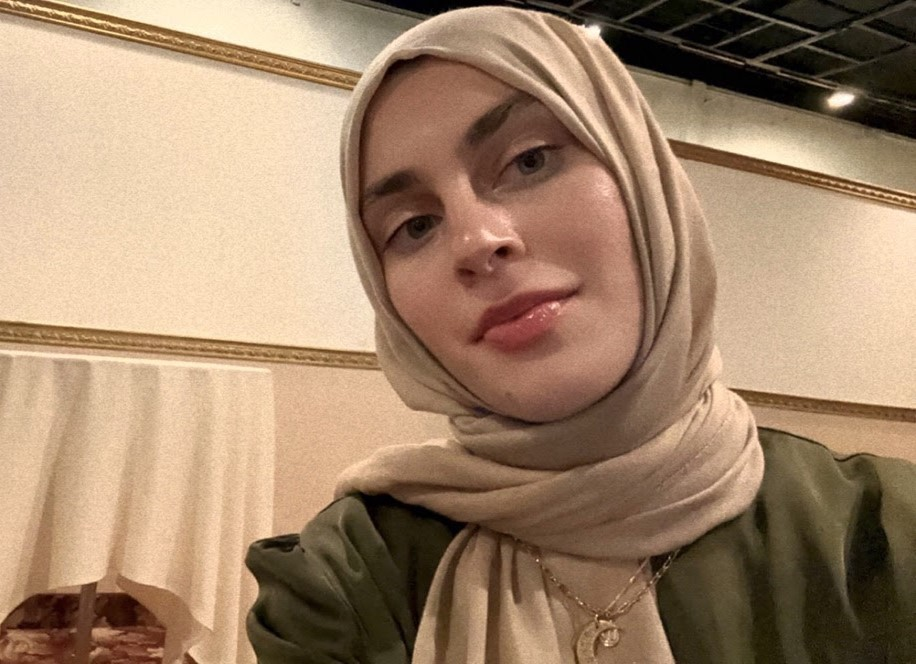
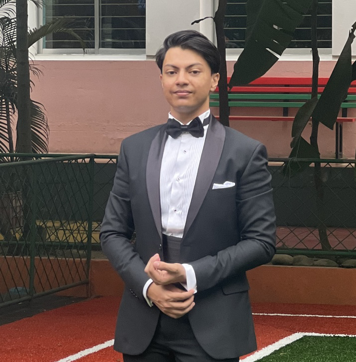
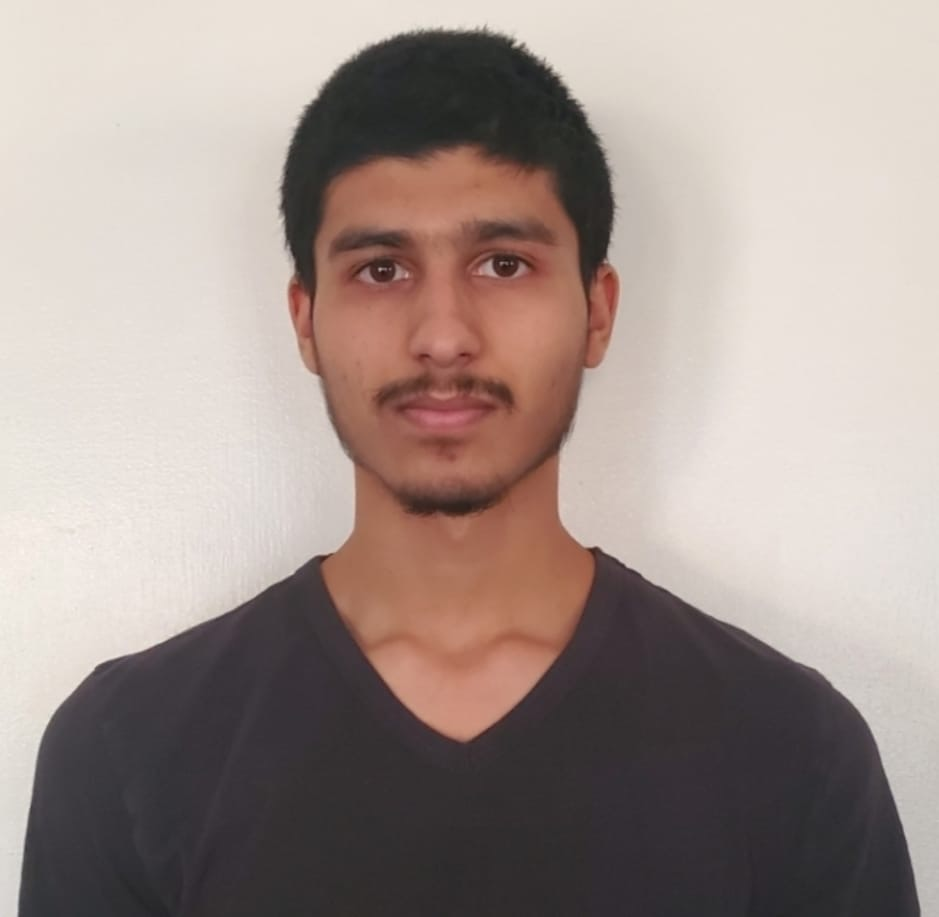
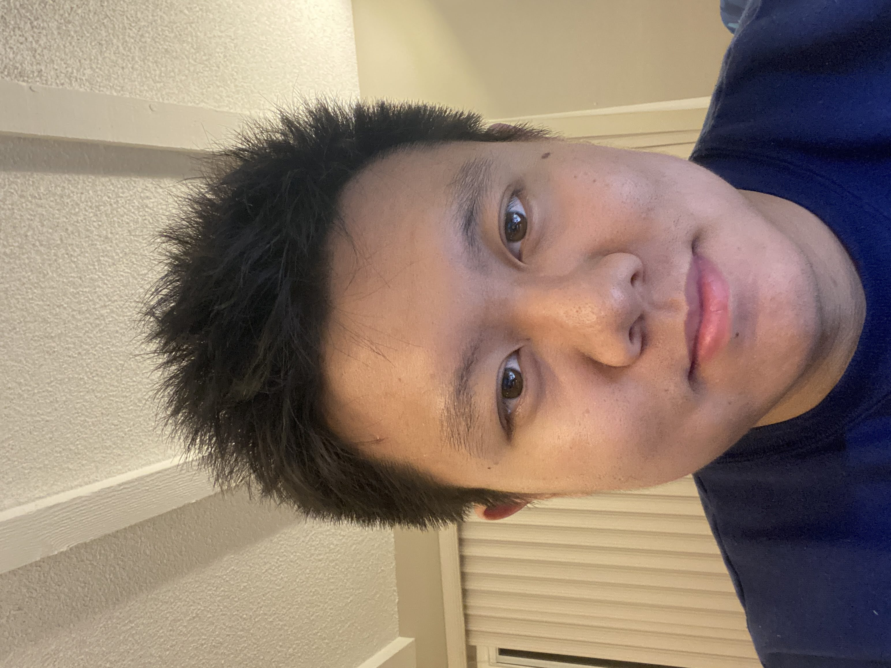

 
 
 
Sahar Karimi, an Afghan American raised in the Bay Area, is currently
 
a Computer Science student at California State University. With a 
 
strong educational background in Computer Science and a deep passion 
 
for technology, she aspires to become a software engineer. In her
 
pursuit of this dream, Sahar is already making strides as a frontend 
 
developer at Allergens, where she dedicates herself to enhancing user 
 
interfaces and experiences. Her commitment and determination are evident
 
in her academic and professional endeavors. Sahar is not only proficient 
 
in English but also fluent in Farsi, Pashto, Arabic, and Urdu, which further 
 
enriches her multicultural perspective.

    
Mohiyan Mahmud (Mohammed Mashnun Mahmud), originally from Dhaka, Bangladesh,  
is now studying in the Bay Area, California at California State University,  
East Bay. Majoring in Computer Science, at an undergraduate level. Mohiyan  
envisions to be a programmer and an entrepeneur, starting so by believing in 
the vision of Allergens and changing the world of sensitivity in regards to nutrition.  
    
Rohan Kumar is a Student at CSU East Bay.  
He's a Computer Science major and currently a junior  
at the start of this company. He was born in Punjab,  
India. As a result, he's fluent in Punjabi, Hindi, and  
English. He's one of the developers of allergens and is  
good at designing the user interface for the website and  
mobile app.  
   

Zhongkang Lyu, originally from China. He is majoring  
in computer science at California State University  
East Bay. He has lived in Canada 
USA and China. He is fluent in Mandarin Chinese  
and English. He is currently a developer af Allergens.  
He believes in using technology  
to make the world a better place   

